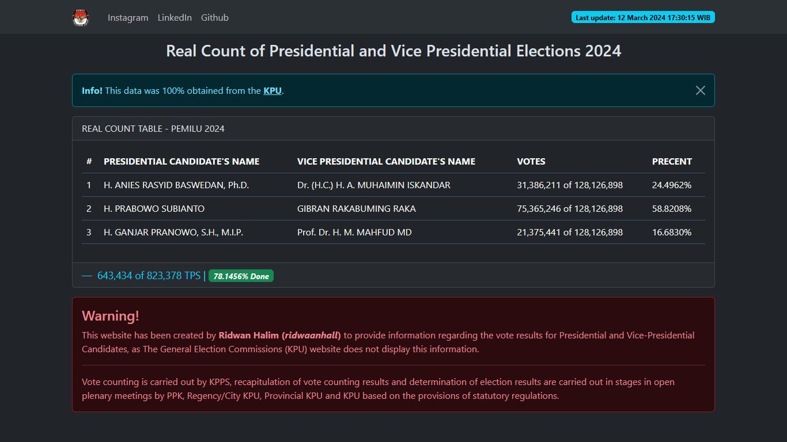

# this data from [KPU](https://pemilu2024.kpu.go.id/)

## click [https://pemilu2024.kpu.go.id/](https://ridwaanhall.github.io/pemilu2024.kpu.go.id/) to see percentage of real count

This website has been created by Ridwan Halim (ridwaanhall) to provide information regarding the vote results for Presidential and Vice-Presidential Candidates, as The General Election Commissions (KPU) website does not display this information.

[](https://wakatime.com/badge/user/018b799e-de53-4f7a-bb65-edc2df9f26d8/project/018e37b6-9795-424a-bf35-4b39e3c4ba59)



## how to check real count?

1. search in google: ridwaanhall

2. clone this repo

```bash
git clone https://github.com/ridwaanhall/pemilu2024.kpu.go.id.git
```

3. run file `run.py`

4. select the number of option

## contact me

- instagram: @ridwaanhall
- github: ridwaanhall

## keyword

- pemilu
- real count
- real count pemilu
- real count pemilu 2024
- kpu
- pemilu 2024
- pemilu 2024 kpu
- H. ANIES RASYID BASWEDAN, Ph.D.
- Dr. (H.C.) H. A. MUHAIMIN ISKANDAR
- H. PRABOWO SUBIANTO
- GIBRAN RAKABUMING RAKA
- H. GANJAR PRANOWO, S.H., M.I.P.
- Prof. Dr. H. M. MAHFUD MD
